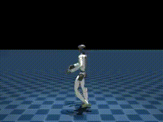
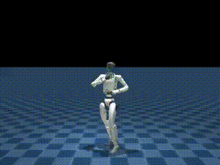

# Motion Tracking — Humanoid Dance Imitation via RL

> Teaching humanoid robots to replicate human dance movements using PPO and progressive curriculum.  
> Motion data is generated by [video2robot_h1_2](https://github.com/josue99999/video2robot_h1_2) — no teleoperation, no manual annotation.

---

## Results

### G1 Huayno Dance (Peruvian Folk)


### G1 Caporal Dance (Peru)


---

## What This Project Does

This branch implements a **whole-body motion tracking task** for humanoid robots (G1 and H1_2). The robot learns to replicate arbitrary human motion sequences — in this case, Peruvian folk dances — extracted directly from video using the `video2robot` pipeline.

This closes the loop between two repositories:

```
[Video] → video2robot → robot_motion.pkl → (this repo) → trained tracking policy
```

The result is a complete **video-to-robot-policy** pipeline: from raw human video to a deployable RL policy, with no hardware teleoperation required at any stage.

---

## Why This Matters

This is a practical implementation of **Imitation Learning from video observation**:

- The motion data comes entirely from simulation-based retargeting — no real robot needed for data collection
- The policy is trained with PPO but the demonstration signal comes from reference motion trajectories (DeepMimic-style reward)
- The curriculum prevents training collapse and generalizes the policy to noisy initial conditions
- The output policy tracks continuous joint angle trajectories — directly relevant to Diffusion Policy and Flow Matching action generation

---

## Pipeline Connection

| Stage | Tool | Output |
|---|---|---|
| Human video | PromptHMR | SMPL-X pose per frame |
| Robot retargeting | GMR IK | `robot_motion.pkl` (joint angles) |
| npz conversion | `csv_to_npz` | `motion.npz` (WandB artifact) |
| Policy training | PPO + curriculum | Tracking policy checkpoint |
| Evaluation | MuJoCo + viser | Video + live viewer |

---

## Datasets

Motion data is stored as WandB artifacts and loaded at training time:

| Dance | Robot | Artifact |
|---|---|---|
| Huayno | G1 | `abadjosue25-abba/csv_to_npz/huayno-g1:v0` |
| Huayno | H1_2 | `abadjosue25-abba/csv_to_npz/huayno-h1-2:v0` |
| Caporal | G1 | `abadjosue25-abba/csv_to_npz/caporal-g1:v0` |
| Caporal | H1_2 | `abadjosue25-abba/csv_to_npz/caporal-h1-2:v0` |

---

## Curriculum Design

The core challenge in motion tracking RL is **early-training collapse**: an untrained policy dies in ~3 steps because it cannot track any reference state. The solution is a **3-phase progressive curriculum** that loosens constraints early and tightens them as the policy improves.

| Term | Phase 1 (0–2k iters) | Phase 2 (2k–5k iters) | Phase 3 (5k–60k iters) |
|---|---|---|---|
| RSI Noise (pose perturbation) | 0% | 50% | 100% |
| End-effector position threshold | 0.5 m | 0.35 m | 0.25 m |
| Anchor orientation threshold | 1.5 rad | 1.2 rad | 0.8 rad |
| Action rate penalty | −0.01 | −0.05 | −0.1 |
| Self-collision penalty | −1.0 | −5.0 | −10.0 |
| Joint velocity penalty | −0.001 | −0.001 | −0.001 |

**RSI = Reference State Initialization**: at each episode reset, the robot is initialized at a random point along the reference trajectory with added pose/velocity noise. This forces the policy to track from arbitrary mid-motion states, not just the beginning — critical for generalization.

Phase 1 gives the untrained policy room to survive. By Phase 3, the policy is evaluated under full perturbation with tight tracking thresholds, producing a robust and precise controller.

---

## Training

### G1 — 4096 environments, ~8 hours to 60k iterations

```bash
# Huayno
uv run train Mjlab-Tracking-Flat-Unitree-G1 \
  --env.scene.num-envs 4096 \
  --registry-name abadjosue25-abba/csv_to_npz/huayno-g1:v0

# Caporal
uv run train Mjlab-Tracking-Flat-Unitree-G1 \
  --env.scene.num-envs 4096 \
  --registry-name abadjosue25-abba/csv_to_npz/caporal-g1:v0
```

### H1_2 — 2048 environments, ~12 hours to 60k iterations

```bash
# Huayno
uv run train Mjlab-Tracking-Flat-H1_2 \
  --env.scene.num-envs 2048 \
  --registry-name abadjosue25-abba/csv_to_npz/huayno-h1-2:v0

# Caporal
uv run train Mjlab-Tracking-Flat-H1_2 \
  --env.scene.num-envs 2048 \
  --registry-name abadjosue25-abba/csv_to_npz/caporal-h1-2:v0
```

---

## Evaluation

```bash
# Play checkpoint with visualization
uv run play Mjlab-Tracking-Flat-Unitree-G1 \
  --checkpoint-file src/mjlab/output/G1_MOTION_TRACKING/model_caporal_59999.pt \
  --motion-file artifacts/caporal-g1:v0/motion.npz

# Record video (500 frames)
uv run play Mjlab-Tracking-Flat-Unitree-G1 \
  --checkpoint-file src/mjlab/output/G1_MOTION_TRACKING/model_caporal_59999.pt \
  --motion-file artifacts/caporal-g1:v0/motion.npz \
  --video True --video-length 500 --num-envs 1
```

---

## Training Metrics (What to Watch)

| Metric | Start | Converged |
|---|---|---|
| Episode length | ~4 steps | 150+ steps |
| Reward | ~0 | ~+4 |
| Entropy | ~1.0 | 0.1–0.3 |

Episode length is the most reliable signal: if it stays at 3–5 steps, the curriculum is not activating or the initial noise is too high.

---

## Top 3 Hardest Problems Solved

### Problem 1 — Early-Training Collapse with Reference State Initialization

When training starts, the policy has no idea how to track a reference trajectory and terminates in 3–5 steps, producing near-zero gradients that never improve. Applying full RSI noise from the beginning makes this worse because the policy is initialized mid-motion with large perturbations it cannot handle. I designed a 3-phase curriculum that starts with zero RSI noise and loose termination thresholds, so the untrained policy can survive long enough to receive meaningful reward signal. Phase transitions are triggered by iteration count, giving each stage enough time to stabilize before increasing difficulty. The result was stable convergence from scratch without manual intervention or warm-start checkpoints.

### Problem 2 — Reward Shaping for Whole-Body Dance Motion

Tracking dance motion is harder than locomotion because the reward must penalize deviation across all joints simultaneously, including upper body, without causing the policy to sacrifice leg stability for arm accuracy. A naive L2 tracking reward on all joints collapsed to a policy that stood still and minimized average error without actually moving. I decomposed the reward into end-effector position terms, anchor orientation terms, and per-joint velocity/action smoothness penalties, weighted so that the lower body (stability) and upper body (expressiveness) were balanced. Self-collision penalties were also progressively tightened to prevent the policy from shortcutting by folding limbs. The final reward composition produced visually recognizable dance motion that maintained balance throughout.

### Problem 3 — WandB Artifact Loading in Constrained Environments

Motion files are stored as WandB artifacts and must be downloaded at training time, which fails silently when `/tmp` has permission restrictions or when the cache directory is not set correctly. This caused hard-to-debug crashes mid-training after the environment had already been initialized. I standardized the training scripts to always set `WANDB_CACHE_DIR=/tmp/wandb_cache` explicitly and added a pre-download fallback that pulls artifacts to a local `artifacts/` folder before training starts. I also documented the manual pre-download command so users can verify artifact access before launching multi-hour training runs. This eliminated a class of non-deterministic failures that only appeared on certain machines.

---

## Key Files

| File | Purpose |
|---|---|
| `src/mjlab/tasks/tracking/mdp/curriculums.py` | 3-phase curriculum logic |
| `src/mjlab/tasks/tracking/mdp/commands.py` | Reference motion sampling and RSI |
| `src/mjlab/tasks/tracking/config/g1/env_cfgs.py` | G1 environment configuration |
| `src/mjlab/tasks/tracking/config/g1/rl_cfg.py` | G1 PPO hyperparameters |
| `src/mjlab/tasks/tracking/config/h1_2/env_cfgs.py` | H1_2 environment configuration |
| `src/mjlab/tasks/tracking/config/h1_2/rl_cfg.py` | H1_2 PPO hyperparameters |

---

## Related Repositories

- [video2robot_h1_2](https://github.com/josue99999/video2robot_h1_2) — generates the motion data used here
- [VELOCITY_RL main branch](https://github.com/josue99999/VELOCITY_RL) — lower-limb velocity tracking policies

---

## License

[Apache 2.0](LICENSE)
